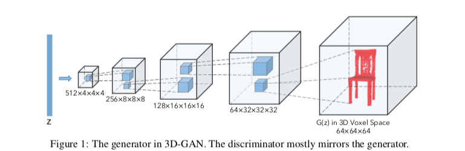
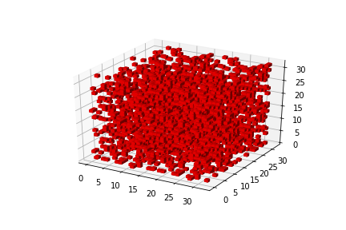

# 3D-GAN
Paper can be found [here](https://arxiv.org/abs/1610.07584).

The paper uses the common Generative Adversarial Network to generate 3D objects from a given probabilistic space. 

More importantly, the paper focuses on the concept of using a Variational Autoencoder to generate a latent vector from a given 2D-image.

Since I don't have both, the time, as well as the resources, to train such a network, I have tried to train a simple 3D-GAN [[Goodfellow et al., 2014](https://arxiv.org/abs/1406.2661)], having a generator as well as a discriminator.

Since we use 3D-objects here, volumetric convolutions have to be used. These simply mean the Conv3D layer and the TransposeConv3D layers in the Pytorch framework. 

Dataset suggested in the paper is the SUN database [[Xiao et al., 2010](https://groups.csail.mit.edu/vision/SUN/)], but it is extremely huge (43 Gigabytes!!!), and also I did not need images (for the VAE part), so I choose the ModelNet10 dataset [[Z. Wu et al., 2015](https://modelnet.cs.princeton.edu/)]. Even in that, I have only chosen to generate chairs, due to memory issues (both RAM and CUDA) on Google Colab. 

Therefore, my dataset now comprises of ~900 examples of chairs.

## Experience
Training the GAN is not easy at all, and not even comparable to a normal Vanilla GAN. 
It has been approximately 10 days since we were assigned the task, 8 days since I have been training the GAN. I am still training the network, and the past results have not been pleasing. Even for single class generation, due to the large variation in the dataset (even in the chair one), a minimum of 10000 epochs have been trained by people on the World Wide Web.
Some have gone to greater lengths of training it for 50000 epochs.

I have been using Google Colaboratory for training my models. In between, I was lucky to have got a Tesla P100 GPU for training, which had massive speed increases of upto **10x**.

Here are some of the modifications I have made to my networks-
1. Used a 32x32x32 model input size.
2. Generator used kernel sizes of {2,2,2,2,2}, strides of {1,2,2,2,2}.
3. Discriminator used kernel sizes of {3,3,3,3,1}, strides of {2,2,2,2,1}.

Adam optimizer has been used, with lr for G=0.0025 and lr for D=0.00001. Beta1 has been adjusted to 0.5.

I use a batch-size of 50.

I finally visualize the voxels by setting the threshold to a value (since sigmoid has been used in the last layer). 

3D model generation is particularly difficult than discriminating between real and fake model. To cater to this problem, a accuracy of 0.8 was limited to train the discriminator, above which only generator should be trained. As per paper, this increasing the learning rate of both (G and D), and also makes training faster.

## Results
I have been debugging this network for a while now, seems to be due to the large variation and the small size of the chair dataset, I end up getting a red-block even at a very high threshold of 0.9.

The loss has been observed to fluctuate very highly for 500 epochs-

